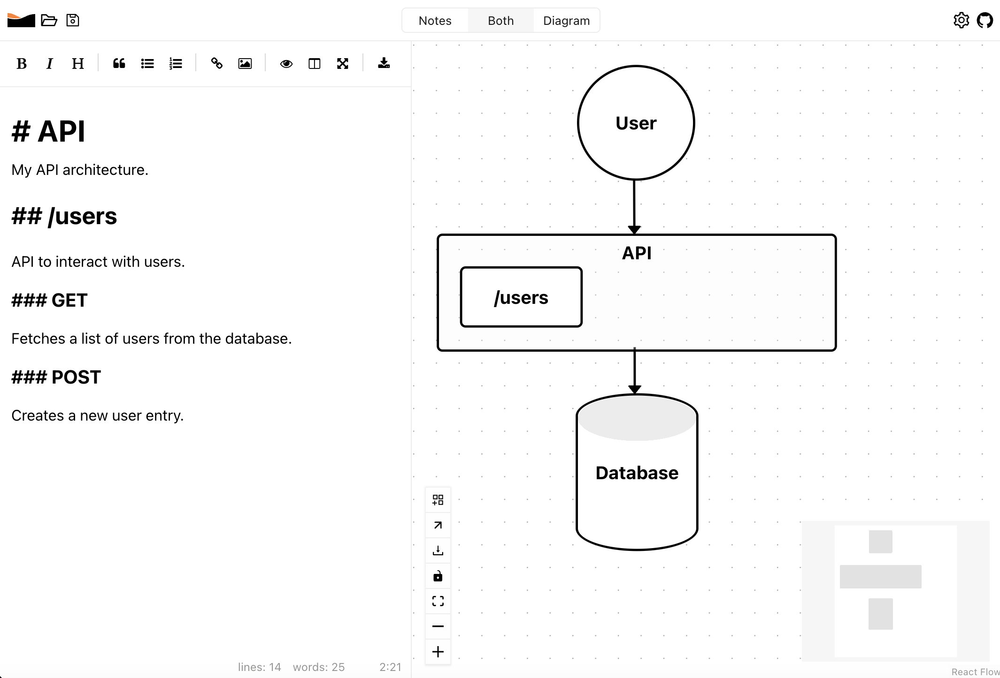

# Arch

Simplify your architecture.

Arch is an architectural editor for any project. Draw your diagrams and write documentation in one simple app :tada: 

Arch is built using [Electron](https://www.electronjs.org/) and [React](https://react.dev/).

## Diagram

For drawing diagrams we use the fantastic [ReactFlow](https://reactflow.dev/) library. Boxes can have different shapes, colors, be groups etc.

Boxes can also have files attached to them. Files that exist can be opened in a simple *code editor*.

## Notes

Notes are written in Markdown, and we use [React SimpleMDE](https://github.com/RIP21/react-simplemde-editor). It is a nice wrapper around [CodeMirror](https://codemirror.net/).

## Code

For opening and editing files attached to boxes we use the [React Monaco Editor](https://github.com/react-monaco-editor/react-monaco-editor) code editor.

## .arch

Files should be saved with the .arch suffix. The `.arch` files are JSON files with a particular struct that Arch understands.

enjoy.
